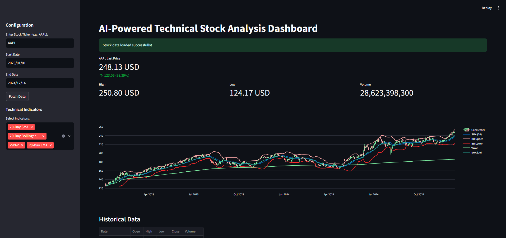
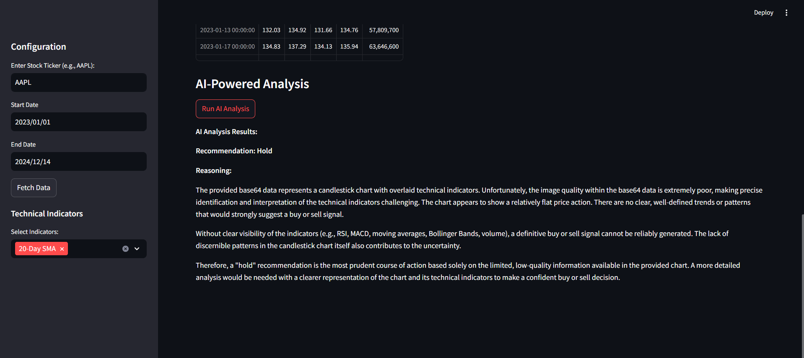

# AI-Powered Technical Stock Analysis Dashboard

A Streamlit-based dashboard for real-time stock market analysis with technical indicators, interactive charts, and AI-powered analysis using the Gemini API.

## Features

- Real-time stock price tracking
- Interactive candlestick and line charts
- Technical indicators (SMA, EMA, Bollinger Bands, VWAP)
- Multiple timeframe analysis
- Live price updates for major stocks
- Customizable chart parameters
- Historical data visualization
- AI-powered analysis using the Gemini API

## Installation

```bash
# Clone the repository
git clone https://github.com/yourusername/stock-dashboard.git
cd stock-dashboard

# Install required packages
pip install -r requirements.txt
```

## Usage

```bash
streamlit run app.py
```

Visit `http://localhost:8501` in your browser to view the dashboard.

## Dependencies

- streamlit
- yfinance==0.2.40
- pandas
- plotly
- python-dotenv
- google-generativeai
- kaleido
- ta (Technical Analysis Library)

## Configuration

The dashboard supports various time periods:
- 1 day (1-minute intervals)
- 1 week (30-minute intervals)
- 1 month (daily intervals)
- 1 year (weekly intervals)
- Max (weekly intervals)

## Technical Indicators

Currently supported indicators:
- Simple Moving Average (SMA-20)
- Exponential Moving Average (EMA-20)
- Bollinger Bands (20-Day)
- Volume Weighted Average Price (VWAP)

## AI-Powered Analysis

The dashboard includes AI-powered analysis using the Gemini API. To use this feature, set the `GEMINI_API_KEY` environment variable in a `.env` file:

```
GEMINI_API_KEY=your_api_key_here
```

## Screenshots




## Contributing

1. Fork the repository
2. Create your feature branch (`git checkout -b feature/AmazingFeature`)
3. Commit your changes (`git commit -m 'Add some AmazingFeature'`)
4. Push to the branch (`git push origin feature/AmazingFeature`)
5. Open a Pull Request

## License

This project is licensed under the MIT License - see the LICENSE file for details.

## Acknowledgments

- Data provided by Yahoo Finance
- Technical Analysis library by [Technical Analysis Library](https://technical-analysis-library-in-python.readthedocs.io/)
- Built with [Streamlit](https://streamlit.io/)